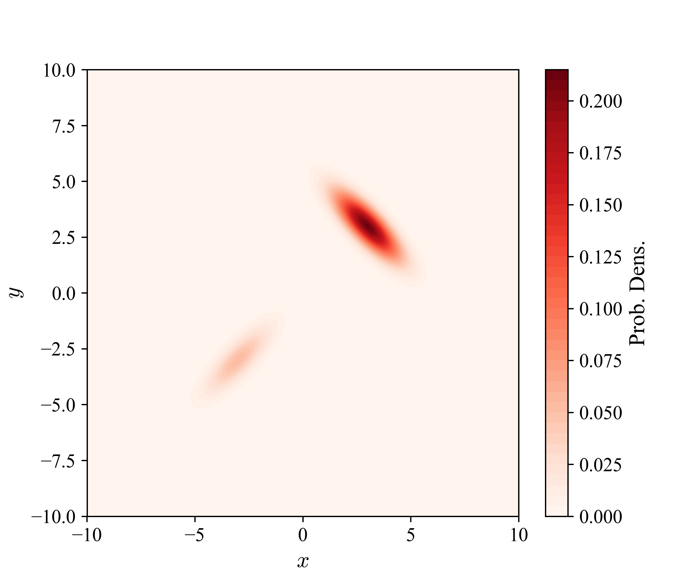
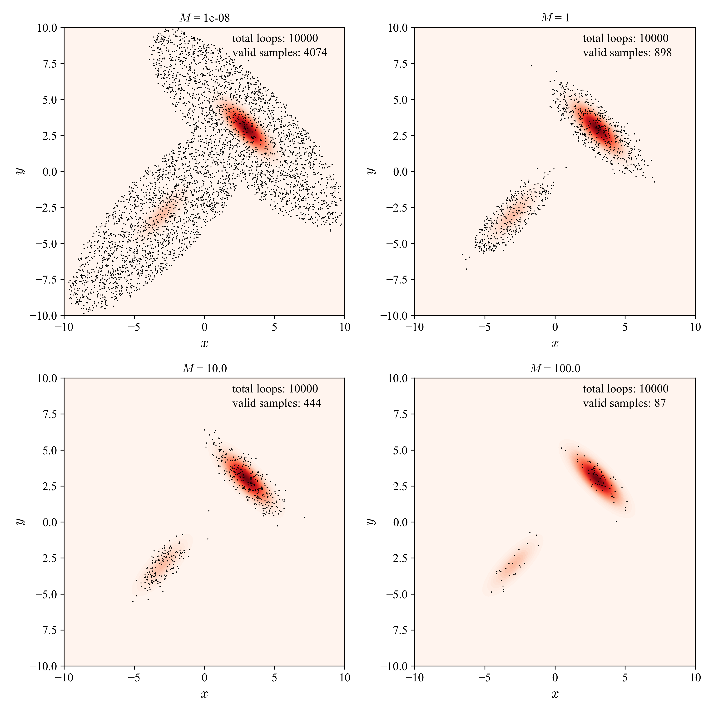
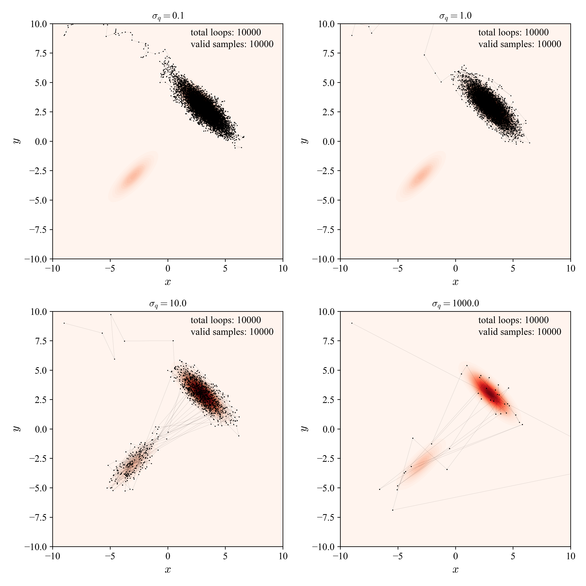
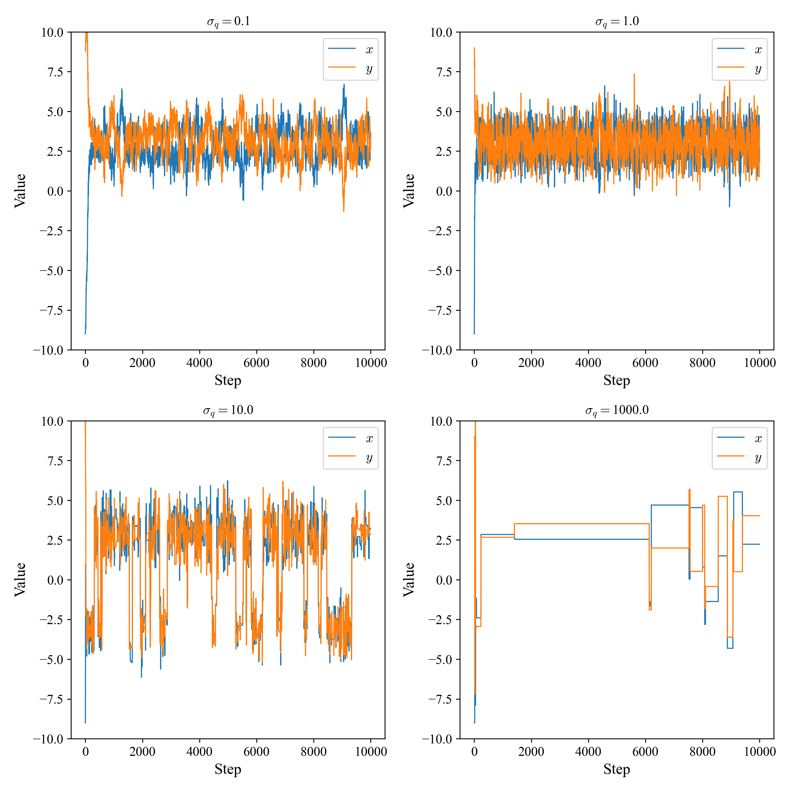

### 随机采样方法和二维混合高斯分布算例

采样（sampling）是指从一个给定（解析或非解析）的概率分布中抽取样本的过程。人们可以利用采样获得的较少样本点快速了解所关心的数据背后变量总体分布的性质和关系，并进行分析建模：
- 均值、方差、分位数等统计指标估计
- 相关、关联度量和因果效应量估计
- 参数估计
- 统计和机器学习模型构建

常见的采样方法有逆变换采样（inverse transform sampling）、接受拒绝采样（accept-reject sampling）、重要性采样（importance sampling）、马尔科夫链蒙特卡洛采样（Markov Chain Monte Carlo, MCMC）、吉布斯采样（Gibbs sampling）、Metropolis-Hastings采样（Metropolis-Hastings sampling）等，下面分别进行介绍。

#### 一、采样方法介绍

#### 1.1 简单随机采样

***1.1.1 逆变换采样***

一种基于累计分布函数（cumulative distribution function, CDF）的采样方法。逆变换采样的基本思想是：首先生成一个服从均匀分布的随机数，然后通过累积分布函数的逆函数，将均匀分布的随机数转换为服从目标分布的随机数。逆变换采样的优点是简单易懂，但是对于复杂的分布，累积分布函数的逆函数往往难以求解，因此逆变换采样的适用范围有限。

逆变换采样过程如下图所示：

逆变换采样适用条件：
- 适用于已知分布的情况
- 适用于低维分布采样。对于高维复杂分布，一般难以获得对应的累计分布密度函数

***1.2 接受拒绝采样***

对于某概率分布 $p(X)$，引入一个简单的提议（proposal）分布 $q(X)$，使得对于 $\forall x_i ∈ X$，$M\cdot q(x_i) ≥ p(x_i)$，其中 $M$ 为某常数。这样一来便可通过提议分布 $q(X)$ 实现对 $p(X)$ 的采样。

接受拒绝采样过程如下图所示：

接受拒绝采样的步骤如下：
1. 从提议分布 $q(X)$ 中采样得到样本 $x_i$
2. 从均匀分布 $U(0, 1)$ 中采样得到随机数 $u$
3. 计算接受率 $\alpha = {p(x_i)}/{M\cdot q(x_i)}$
4. 如果 $u < \alpha$，则接受样本 $x_i$，否则拒绝样本 $x_i$

接受拒绝采样适用条件：
- 适用于目标分布概率密度函数（probability density function, PDF） $p(X)$ 已知的情况
- 适用于任意形状的 $p(X)$
- 适用于高维分布采样。对于高维复杂分布，可以通过引入简单的提议分布 $q(X)$ 实现采样

> 注意：
> * 接受拒绝采样的效率取决于提议分布 $q(X)$ 和 $M$ 的选择；
> * 提议分布 $q(X)$ 的选择越接近目标分布 $p(X)$、$M$ 越小，则接受率 $\alpha$ 高、采样效率也越高（获得相同样本量所需迭代次数更少）。

***1.3 重要性采样***

以上介绍的逆变换和接受拒绝采样都是为了对目标分布 $p$ 进行采样，而重要性采样则是对某符合潜在分布 $p$ 的变量 $X$ 在函数 $f(·)$ 作用下的期望 $\mathbb E_{p(x)}[f(x)]$进行采样：

$$
\begin{align*}
\mathbb E_{p(x)}[f(x)] &= \int f(x) p(x) dx \\
    &= \int f(x) \frac{p(x)}{q(x)} q(x) dx \\
    &\approx \frac{1}{N} \sum_{i=1}^N f(x_i) \frac{p(x_i)}{q(x_i)} \\
    &= \frac{1}{N} \sum_{i=1}^N f(x_i)w_i \\
    x_i &\sim q(X), i = 1, 2, \cdots, N
\end{align*}
$$

其中，$w_i = \frac{p(x_i)}{q(x_i)}$ 为重要性权重，衡量了不同 $x_i$ 取值所得 $f(x_i)$ 对于 $f(x)$ 总体期望的影响。

重要性采样使用条件：
- 可对任意形状的概率分布进行采样
- 可对高维复杂分布进行采样，对期望值 $\mathbb E_{p(x)}[f(x)]$ 进行估计

> 注意：
> * 重要性采样的估计方差较大，需通过增加采样量 $N$ 来减小估计方差。

#### 1.2 基于马尔可夫过程的随机采样

在工业过程建模、分子动力学模拟等领域，所研究的过程高维复杂，难以获得充分的样本反映其
全貌，此时可采用基于马尔可夫链的迭代采样逐步获得所感兴趣的参数和变量的近似分布。

***1.2.1 Markov Chain Monte Carlo采样***

马尔可夫链蒙特卡洛采样（Markov Chain Monte Carlo, MCMC）是一种基于马尔可夫链的随机采样方法，通过构建一个马尔可夫链，使其平稳分布为目标分布 $p(X)$，从而实现对目标分布的采样。

MCMC的采样过程为：
1. 初始化马尔可夫链状态 $x_{t=0}$
2. 从**提议分布** $q(X|x_t)$ 中采样得到下个候选状态 $x^*$
3. 计算**接受概率** $\alpha = \min\left(1, {p(x^*)}/{p(x_t)}\right)$
4. 从均匀分布 $U(0, 1)$ 中采样得到随机数 $u$
5. 如果 $u < \alpha$，则接受候选状态 $x^*$，否则保持当前状态 $x_t$
6. 重复步骤2-5，直至马尔可夫链收敛
7. 采样得到的状态序列 $\{x_0, x_1, \cdots, x_T\}$ 即为目标分布 $p(X)$ 的采样

> 注意：
> * 在MCMC采样过程中，下一时刻状态 $x_{t+1}$ 的生成依赖于上个时刻状态 $x_t$，因此MCMC采样得到的样本序列是相关的，相邻样本之间可能不满足独立性，这是基于马尔可夫链采样方法的一个特点；
> * 因此，需要通过一定的方法对样本序列继续进行抽样，取得满足独立同分布（Identically and Independently Distributed, i.i.d.）条件的样本序列进行后续的统计分析与建模。

***1.2.2 Metropolis-Hastings采样***

某些情况下，MCMC采样的接受率 $\alpha$ 可能会很小，导致算法需要经历很多次迭代才能到达平稳。M-H采样主要解决了MCMC中接受概率 $\alpha$ 可能过低的问题，通过对接受概率修正提高采样效率：

$$
\alpha = \min\left(1, \frac{p(x^*)q(x_t|x^*)}{p(x_t)q(x^*|x_t)}\right)
$$

其中，$q(x_t|x^*)$、$q(x^*|x_t)$ 为提议概率。可见，M-H采样考虑把MCMC接受率等式的两侧同步放大，将其中的一个接受概率设置为1，这样就能保证每次迭代过程中接收新状态的概率越大，从而加速算法收敛。

> 注意：
> * M-H中**提议分布概率需要满足对称性**，即 $q(x_i|x_j) = q(x_j|x_i), \forall i,j$；
> * 提议分布概率与接受率的乘积为状态**转移概率**：$P(x_j|x_i) = q(x_j|x_i)\alpha(x_j|x_i)$；
> * 采样所得马尔可夫链需满足的**细致平稳条件**：$\pi(x_i)P(x_j|x_i) = \pi(x_j)P(x_i|x_j), \forall i,j$，其中 $\pi(x)$ 为过程平稳分布的概率值，对应于目标分布 $p(X)$
> 通过简单尝试可知，**对于特定的 $\pi$，满足细致平稳条件的转移概率 $P$ 并不唯一，M-H采样只是构造了一种满足细致平稳条件的转移概率**。

***1.2.3 Gibbs采样***

对于复杂过程，一般难以对其中多个参数的高维**联合后验分布**（joint posterior distribution）直接进行采样估计，但更容易对各参数在低维情形下的**全条件分布**（full conditional distribution）进行处理。这样便可使用Gibbs采样器以迭代方式进行采样，最终逼近模型参数的联合后验分布。

Gibbs采样旨在根据各参数的全条件概率密度进行采样，还原所有模型参数的联合后验概率密度，由此获得模型参数期望、中位数、置信区间等一系列统计指标。Gibbs采样旨在通过以下多步低维采样获得多个参数的联合分布：

$$
\begin{align*}
    \left\{
    \begin{array}{l}
    p(\theta_1|\theta_2, \theta_3, \cdots, \theta_n) \\
    p(\theta_2|\theta_1, \theta_3, \cdots, \theta_n) \\
    \cdots \\
    p(\theta_n|\theta_1, \theta_2, \cdots, \theta_{n-1})
    \end{array}
    \right. \rightarrow p(\theta_1, \theta_2, \cdots, \theta_n)
\end{align*}
$$

具体地，在第 $t$ 次迭代中，Gibbs采样过程如下：

1. 初始化参数 $\theta^{(0)} = (\theta_1^{(0)}, \theta_2^{(0)}, \cdots, \theta_n^{(0)})$；
2. 对于第 $t$ 次迭代，依次对各参数 $\theta_i$ 进行采样：
    - 采样 $\theta_1^{(t)} \sim p(\theta_1|\theta_2^{(t-1)}, \theta_3^{(t-1)}, \cdots, \theta_n^{(t-1)})$
    - 采样 $\theta_2^{(t)} \sim p(\theta_2|\theta_1^{(t)}, \theta_3^{(t-1)}, \cdots, \theta_n^{(t-1)})$
    - $\cdots$
    - 采样 $\theta_n^{(t)} \sim p(\theta_n|\theta_1^{(t)}, \theta_2^{(t)}, \cdots, \theta_{n-1}^{(t)})$
    - 得到第 $t$ 次迭代参数 $\theta^{(t)} = (\theta_1^{(t)}, \theta_2^{(t)}, \cdots, \theta_n^{(t)})$
3. 重复步骤2，直至收敛；
4. 采样得到的参数序列 $\{\theta^{(0)}, \theta^{(1)}, \cdots, \theta^{(T)}\}$ 即为目标联合后验分布的样本。

#### 二、案例分析

#### 2.1 二维混合高斯分布采样

本案例通过接受拒绝和M-H采样对二维混合高斯分布进行采样，并对采样结果进行可视化展示。在以 $x$ 和 $y$ 构成的二维平面上，某二元高斯分布的概率密度函数为：

$$
p(x, y) = \frac{1}{2\pi\sigma_1\sigma_2\sqrt{1-\rho^2}} \exp\left(-\frac{1}{2(1-\rho^2)}\left[\frac{(x-\mu_1)^2}{\sigma_1^2} - 2\rho\frac{(x-\mu_1)(y-\mu_2)}{\sigma_1\sigma_2} + \frac{(y-\mu_2)^2}{\sigma_2^2}\right]\right)
$$

记作 $p(x, y) \sim \mathcal N(\mu, \Sigma)$，其中 $\mu = (\mu_1, \mu_2)$ 为均值向量，$\Sigma = \begin{bmatrix} \sigma_1^2 & \rho\sigma_1\sigma_2 \\ \rho\sigma_1\sigma_2 & \sigma_2^2 \end{bmatrix}$ 为协方差矩阵，$\rho$ 为相关系数。

本案例的分布由两个二元高斯分布叠加而成，参数分别为：

$$
\begin{align*}
\mu_1 = [-3, -3], \Sigma_1=\begin{bmatrix} 1 & 0.9 \\ 0.9 & 1 \end{bmatrix} \\
\mu_2 = [3, 3], \Sigma_2=\begin{bmatrix} 1 & -0.9 \\ -0.9 & 1 \end{bmatrix}
\end{align*}
$$

权重为 $w_1 = 0.2$，$w_2 = 0.8$，所得PDF如下图所示：

接下来，分别采用不同方法对二维混合高斯分布进行采样。

***2.1.1 接受拒绝采样***

对于该案例，设计接受拒绝采样的提议分布 $q(X)$ 为在 $x\in [-10, 10]$、$y\in [-10, 10]$ 区域内的二维均匀分布，即 $q(X) \sim U(-10, 10)$、$q(Y) \sim U(-10, 10)$。通过在不同参数 $M$ 设置下进行接受拒绝采样，得到结果如下图所示：

可见，当 $M$ 值很小时，接受率 $\alpha$ 高，但是所得样本分布与目标分布差异较大，在高PDF区域，样本点几乎呈均匀分布；当 $M$ 值增大时，所得样本分布逐渐逼近目标分布，但接受率 $\alpha$ 逐步降低，导致采样效率的降低，即通过相同迭代次数得到的样本量减少。

***2.1.2 M-H采样***

对于该案例，设计M-H采样的提议分布为：当前状态 $x_i$ 附近以方差 $\sigma_q^2$ 的高斯分布：

$$
q(x_j|x_i) = \mathcal N(x_i, \sigma_q^2)
$$

这将状态 $x_i$ 限制在其由 $\sigma_q$ 决定的邻域范围内转移。易验证，提议分布 $Q$ 满足对称性：

$$
q(x_j|x_i) = q(x_i|x_j), \forall i, j
$$

本案例设置初始迭代点为 $(-9, 9)$，通过在不同参数 $\sigma_q$ 设置下进行M-H采样，得到结果如图所示：

从图中可见，M-H采样效果与提议分布和初始状态有关，当 $\sigma_q$ 较小时，提议分布较为集中，算法对新状态的接受率较高，但未能在设置的迭代次数下获得符合目标分布的样本；而当 $\sigma_q$ 较大时，提议分布较为分散，算法对新状态接受率较低，但所得样本分布逐渐逼近目标分布。

下图显示了在不同 $\sigma_q$ 下，M-H采样所得 $x$ 和 $y$ 的收敛情况：

从结果可见，在迭代初期，$x$ 和 $y$ 值波动较大未收敛，这部分样本应被剔除；随着迭代次数的增加，$x$ 和 $y$ 的值逐渐稳定在目标分布的均值附近，这表明M-H采样算法逐步收敛到目标分布。另一方面，参数 $\sigma_q$ 的选择对算法效率有较大影响，当 $\sigma_q$ 较小时，接受率较高，但所得样本分布与目标分布差异较大；随着 $\sigma_q$ 的逐渐增大，接受率降低，但所得样本分布逐渐逼近目标分布；但是，过大的 $\sigma_q$ 会导致算法收敛速度变慢，需要更多迭代次数才能获得符合目标分布的样本。对于本案例，最佳的 $\sigma_q$ 值应在 $10$ 附近。

#### 三、总结

本案例介绍了二维混合高斯分布的采样方法，包括接受拒绝采样和M-H采样。通过对比两种采样方法，可以发现：
- 接受拒绝采样适用于任意形状的目标分布，但需要设置合适的提议分布和参数 $M$，以提高采样效率；
- M-H采样适用于高维复杂分布，通过设置合适的提议分布和参数 $\sigma_q$，可以逐步收敛到目标分布。

在实际应用中，可根据目标分布的特点选择合适的采样方法，以获得高效的采样结果。
