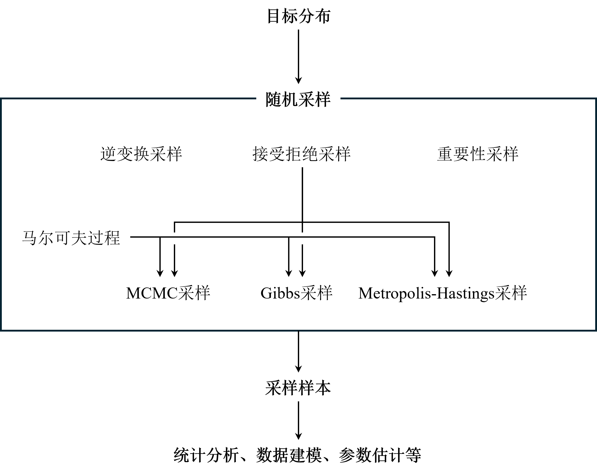
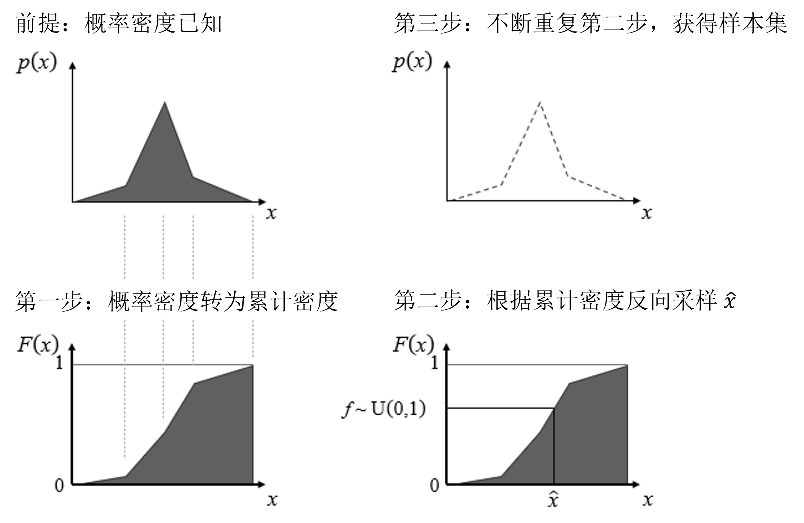
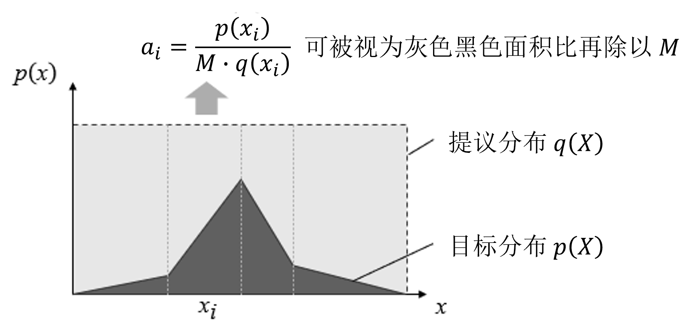

### 二维混合高斯分布采样算例

采样（sampling）是指从一个给定（解析或非解析）的概率分布中抽取样本的过程。人们可以利用采样获得的较少样本点快速了解所关心的数据背后变量总体分布的性质和关系，并进行分析建模：
- 均值、方差、分位数等统计指标估计
- 相关、关联度量和因果效应量估计
- 参数估计
- 统计和机器学习模型构建

常见的采样方法有逆变换采样（Inverse Transform Sampling）、接受拒绝采样（Accept-reject Sampling）、重要性采样（Importance Sampling）、马尔科夫链蒙特卡洛采样（Markov Chain Monte Carlo, MCMC）、吉布斯采样（Gibbs Sampling）、Metropolis-Hastings采样（Metropolis-Hastings Sampling）等，下面分别进行介绍。

#### 一、采样方法介绍

##### 1.1 逆变换采样

一种基于累积分布函数（CDF）的采样方法。逆变换采样的基本思想是：首先生成一个服从均匀分布的随机数，然后通过累积分布函数的逆函数，将均匀分布的随机数转换为服从目标分布的随机数。逆变换采样的优点是简单易懂，但是对于复杂的分布，累积分布函数的逆函数往往难以求解，因此逆变换采样的适用范围有限。

逆变换采样过程如下图所示：

逆变换采样适用条件：
- 适用于已知分布的情况
- 适用于低维分布采样。对于高维复杂分布，一般难以获得对应的累计分布密度函数

##### 1.2 接受拒绝采样

对于某概率分布 $p(X)$，引入一个简单的提议（proposal）分布 $q(X)$，使得对于 $\forall x_i ∈ X$，$M\cdot q(x_i) ≥ p(x_i)$，其中 $M$ 为某常数。这样一来便可通过提议分布 $q(X)$ 实现对 $p(X)$ 的采样。

接受拒绝采样过程如下图所示：

接受拒绝采样的步骤如下：
1. 从提议分布 $q(X)$ 中采样得到样本 $x_i$
1. 从均匀分布 $U(0, 1)$ 中采样得到随机数 $u$
2. 如果 $u < {p(x_i)}/{M\cdot q(x_i)}$，则接受样本 $x_i$，否则拒绝样本 $x_i$

接受拒绝采样适用条件：
- 适用于目标分布概率密度函数 $p(X)$ 已知的情况
- 适用于任意形状的 $p(X)$
- 适用于高维分布采样。对于高维复杂分布，可以通过引入简单的提议分布 $q(X)$ 实现采样

> 注意：接受拒绝采样的效率取决于提议分布 $q(X)$ 和 $M$ 的选择，提议分布 $q(X)$ 的选择越接近目标分布 $p(X)$、$M$ 越小，则接受率 $\alpha$ 高、采样效率也越高（获得相同样本量所需迭代次数更少）

##### 1.3 重要性采样

以上介绍的逆变换和接受拒绝采样都是为了对目标分布 $p$ 进行采样，而重要性采样则是对某符合潜在分布 $p$ 的变量 $X$ 在函数 $f(·)$ 作用下的期望 $\mathbb E_{p(x)}[f(x)]$进行采样：

$$
\begin{align*}
\mathbb E_{p(x)}[f(x)] &= \int f(x) p(x) dx \\
    &= \int f(x) \frac{p(x)}{q(x)} q(x) dx \\
    &\approx \frac{1}{N} \sum_{i=1}^N f(x_i) \frac{p(x_i)}{q(x_i)} \\
    &= \frac{1}{N} \sum_{i=1}^N f(x_i)w_i \\
    x_i &\sim q(X), i = 1, 2, \cdots, N
\end{align*}
$$

其中，$w_i = \frac{p(x_i)}{q(x_i)}$ 为重要性权重，衡量了不同 $x_i$ 取值所得 $f(x_i)$ 对于 $f(x)$ 总体期望的影响。

重要性采样使用条件：
- 可对任意形状的概率分布进行采样
- 可对高维复杂分布进行采样，对期望值 $\mathbb E_{p(x)}[f(x)]$ 进行估计

> 注意：重要性采样的估计方差较大，需通过增加采样量 $N$ 来减小估计方差